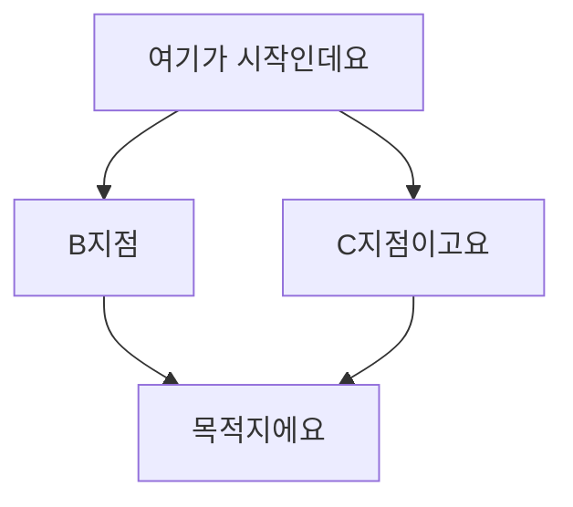

# my-frst-repo
My First Repository : Dev-Ops Lecture by Bryan Son.

## What is This? 

SKKU 2022 Winter Software lecture with Engineers in SiliconValley.

## Instructor

Bryan Son, Working in Github

## FlowChart

