# my-frst-repo
My First Repository : Dev-Ops Lecture by Bryan Son.

[SKKU CS](http://cs.skku.edu/)

 - SKKU CS 2018~
 - TSS 2022~
 - Miner inc 2022~

## What is This? 

SKKU 2022 Winter Software lecture with Engineers in SiliconValley.

## Instructor

Bryan Son, Working in Github

|1|2|3|
|--|--|--|
|🥺|🥺|🥺|

## FlowChart

```mermaid
  flowchart TD;
      A[여기가 시작인데요]-->B[B지점];
      A-->C[C지점이고요];
      B-->D[목적지에요];
      C-->D;
```

